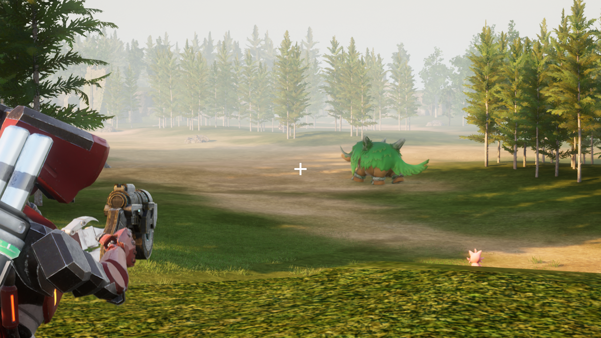

Replaces the sci-fi style default reticle with a simple cross.



The replacement reticle supports adjusting the color and toggling the outline in the options just like the original.

I based this on the asset used to indicate a valid grapple target in game, though it has been redrawn at a higher resolution as needed for the primary reticle. As such I also swapped out that indicator for some simple triangles, which are a bit easier to see than if I simply swapped the two reticles.

I kind of wish I could have gone with something even more minimal, but due to the fact that the reticle changes size to indicate recoil options are a bit limited. The way it is scaled in that process is very simple and is likely to introduce aliasing, which will cause problems for a thinner reticle. I made some adjustments to the reticle to try and prevent this, but if you see obvious artifacts with your settings let me know and I can make further adjustments. The original reticle being diagonal helps with this as the fuzzy diagonal edges won't produce obvious aliasing the same way straight ones will.

## Installation

The recommended method is to install the mod by subscribing on the [Steam Workshop](https://steamcommunity.com/sharedfiles/filedetails/?id=3643178578).

After you subscribe to the mod, do these steps to enable the mod:

1. Launch the game and wait until you get to the title screen.
2. Go to Options > Mod Management and make sure **Enable Mod** is set to **ON**.
3. Make sure the checkboxe next to Simple Reticle is **CHECKED**
4. Click the blue **Save** button and the game will now restart.
5. Once the game starts up again, Simple Reticle should now be enabled.

## Building

**See the top level [README](../README.md) for information about setting up the build in general.**

This mod makes use of a Pak file so it will need to use Unreal Engine to compile the associated project found in the `./Unreal` folder.

To build the mod use the following command in the root of the repository:

```bash
make SimpleReticle
```

This will a folder `./out/workshop/3643178578` which contains the steam workshop files.

You can use the following command to install the generated files into your local Steam Workshop folder so that the game will find them:

```bash
make install MODS=SimpleReticle
```
