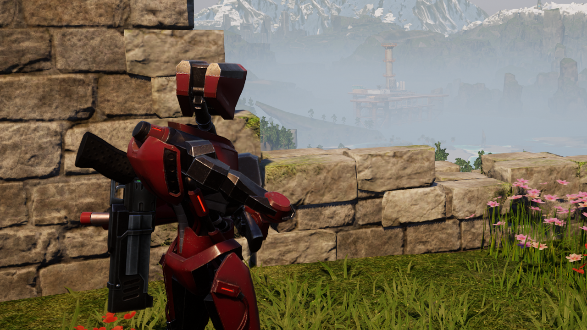

# Ultrakill Wing Remover

This mod removes the wings from the two ULTRAKILL collaboration armor sets.

The armor does look kind of funny without them, but the wings block so much of your view that it is definitely worth it.



## Installation

The recommended method is to install the mod by subscribing on the [Steam Workshop](https://steamcommunity.com/sharedfiles/filedetails/?id=3641512642).

After you subscribe to the mod, do these steps to enable the mod:

1. Launch the game and wait until you get to the title screen.
2. Go to Options > Mod Management and make sure **Enable Mod** is set to **ON**.
3. Make sure the checkboxe next to Ultrakill Wing Remover is **CHECKED**
4. Click the blue **Save** button and the game will now restart.
5. Once the game starts up again, Ultrakill Wing Remover should now be enabled.

## Building

**See the top level [README](../README.md) for information about setting up the build in general.**

This mod makes use of a Pak file so it will need to use Unreal Engine to compile the associated project found in the `./Unreal` folder.

To build the mod use the following command in the root of the repository:

```bash
make UltrakillWingRemover
```

This will a folder `./out/workshop/3641512642` which contains the steam workshop files.

You can use the following command to install the generated files into your local Steam Workshop folder so that the game will find them:

```bash
make install MODS=UltrakillWingRemover
```
